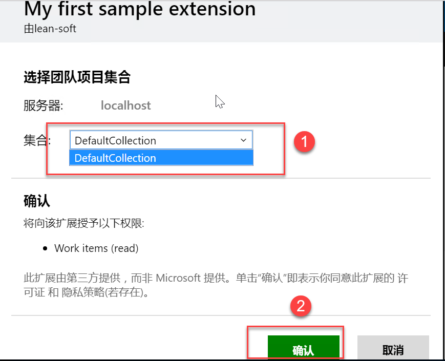

说明
====

1. 以下测试程序在TFS2017Update2 环境实验，不支持TFS2015 版本
2. 扩展程序依赖nodejs,实验使用版本为 8.7.0
3. 服务端测试程序依赖 .NetCore2.0

创建扩展程序
===========

新建测试项目文件夹：tfs-extension-demo 
1.	在tfs-extension-demo 文件夹中建立文件夹sdk,images
2.	在sdk 文件夹中执行命令获取客户端SDK：
```javascript
npm install vss-web-extension-sdk
```
3.	在tfs-extension-demo 文件夹中建立workitemPage.html 文件
4.	在tfs-extension-demo 文件夹中建立 vss-extension.json 文件

打包扩展程序
===========
1.	下载TFS Cross Platform Command Line Interface (tfx-cli):
```javascript
npm i -g tfx-cli
```
2.	执行打包命令：
```javascript
tfx extension create --manifest-globs vss-extension.json
```
安装扩展程序到TFS Server
=======================
1. 在【扩展】选项卡中点击【浏览本地扩展】

2. 页面打开后，点击【管理扩展】

3. 在管理扩展页面中，点击【上载新扩展】

4. 在上载新项弹出窗口中，点击【浏览】

5. 选择好打包好的扩展包，进行上传

6. 完成后，列边中出现刚上传的扩展

7. 点击扩展名称后边的【...】，在弹出菜单中选择【安装】，如果以后有新版本需要更新，可以在这里选择【更新】菜单。

8. 在弹出窗口，选择要安装到的集合，并安装

9. 完成安装后，关闭。


定制模板
=======
1. 导出模板
* 打开Developer Command Prompt,执行命令：
```
witadmin exportwitd /collection:CollectionURL /p:Project /n:TypeName /f:FileName
```
* 命令解释：

CollectionURL 为集合URL 如：  
http://localhost:8080/tfs/defaultCollection    
Project 为项目名称，如：**first**   
TyepName 为工作项类型 ,如：**产品积压工作项**        
FielName 为标题，如：**www**      

以我本地配置为例，最终执行命令如下：
```
Witadmin exportwitd /collection:http://localhost:8080/tfs/defaultCollection /p:secord /n:产品积压工作项 /f:1
```
执行命令成功后，会在Developer Command Prompt 所在目录生成文件：1

2. 修改模板
* 打开文件1，找到WebLayout节点,如下图：

* 增加以下内容：
```
<Extensions>
<Extension Id="lean-soft.sample-extension" />
</Extensions>
```
3. 导入模板
```
witadmin importwitd /collection:http://localhost:8080/tfs/defaultCollection /p:secord /f:1
```

查看扩展结果
===========

1. 在工作积压项页面中，双击列表中的标题小图标

2. 弹出产品工作积压项页面，【My Page】 选项卡为我们自定义的扩展，页面上展示的内容为调用接口获取，并解析出来的。

3. 由于未解析前是一个Document 对象，所以不能显示详细信息出来，可以在控制台中看到

4. 也可以通过调用接口，直接看到数据，如：


